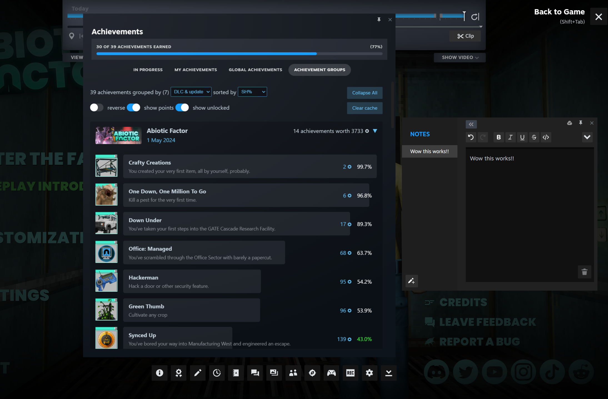
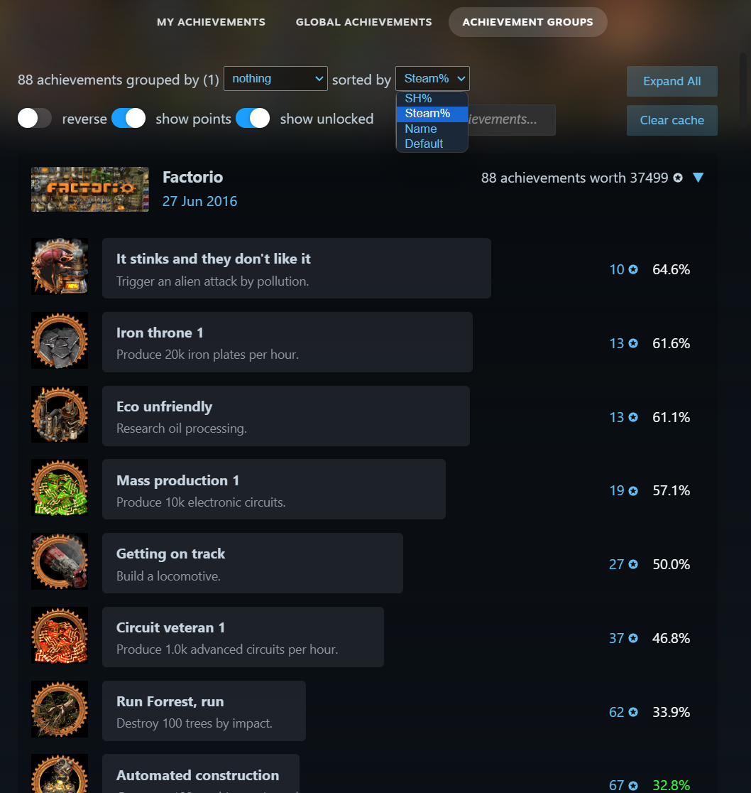
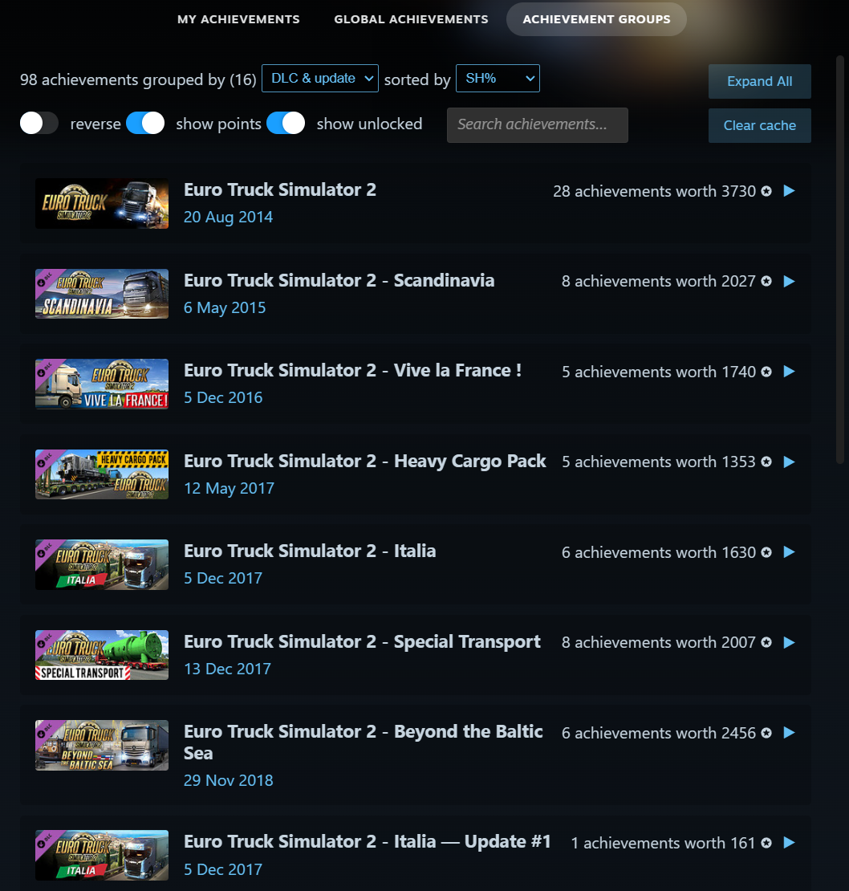

# Achievement groups plugin for Millennium

This plugin brings the achievement groups and many other features of the [SteamHunters website](https://steamhunters.com/) right into your Steam client using Millennium. With a beautiful interface and a lot of customization options, it's the perfect tool for achievement hunters.

## Features

- **Dynamic Grouping**: Automatically group achievements by DLC, Updates, and more using SteamHunters data.
- **Achievement Points**: View point values for every achievement, giving you a better sense of rarity and difficulty.
- **Enhanced Overlay**: A modernized achievements interface that also works seamlessly in the Steam Overlay and also Big Picture Mode while playing.
- **Full controller support**: Navigate the interface in Big Picture Mode fully using your controller.
- **Deep Customization**: Toggle points, tags, guides, and player counts to tailor the experience to your hunting style.
- **Advanced Sorting**: Sort by SH%, rarity, or date, with support for reverse ordering.

## Preview

| **Achievement Groups View** | **Customization & Preferences** |
|:---:|:---:|
|  |  |
| **Works in the steam overlay** | **Sorting & Filtering** |
|  |  |
| **Big Picture Mode** | **Great grouping for many dlc** |
|  |  |

## Installation

1. Ensure you have [Millennium](https://steambrew.app/) installed.
2. Download the [latest release](https://github.com/tddebart/SteamHunter-plugin/releases/latest) of this plugin from GitHub or install it automatically from the [Steambrew](https://steambrew.app/plugin?id=13f2dcc363c8) website.
3. Place the plugin folder into your Millennium plugins directory if you installed it manually.
4. Restart Steam.
5. Enable **Achievement Groups** in the Millennium settings menu.

> [!TIP]
> If the plugin doesn't appear immediately, fully exit Steam via the taskmanager and restart.

## Usage

Once installed, navigate to any game in your library and click **"View my achievements"**. You will see a new **ACHIEVEMENT GROUPS** tab next to the default Steam tabs.

## Contributing

Contributions are welcome! Whether it's a bug fix or a new feature, feel free to open a Pull Request.

### Development Setup

> It is recommended to put the plugin repository in your Steam plugins folder or make some symbolic links to the
> repository for easier development.

1. Clone the repo: `git clone https://github.com/tddebart/SteamHunter-plugin.git`
2. Install dependencies: `bun install`
3. Start development mode: `bun watch` (watches frontend and styles).
4. Press `F5` in Steam to reload the UI changes.

> [!NOTE]
> Backend changes require a full Steam restart to take effect.

## Special Thanks

- **[SteamHunters](https://steamhunters.com/)**: For their incredible API and community data.
- **[Millennium](https://github.com/SteamClientHomebrew/Millennium)**: The framework making this all possible.

## License

MIT License. See [LICENSE](LICENSE) for details.
